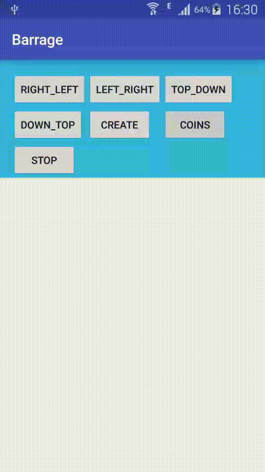

# Barrage

It is a library to create a effect such as below.


Yes, it is a Native Barrage like bilibili.com. You can easily get it.

And, if you want to have a effect of coins' dropping down:



And, if you want a balloons' rising:


The demo is available [here](https://github.com/helloyingying/Barrage/releases/tag/0.0.1).

# Installation

### gradle

```
compile 'com.liuzhuang.opensource:barrage:0.0.1'
```

### maven

```
<dependency>
  <groupId>com.liuzhuang.opensource</groupId>
  <artifactId>barrage</artifactId>
  <version>0.0.1</version>
  <type>pom</type>
</dependency>
```

# Basic usage

In xml(you can also create the view programmatically):

```
<com.android.liuzhuang.library.ui.BarrageView
    android:layout_width="match_parent"
    android:layout_height="match_parent"
    android:layout_below="@id/start"
    android:id="@+id/barrag
```
And in code:

```
Barrage barrage = new Barrage(this, (BarrageView) findViewById(R.id.barrage));

List<BarrageDo> data = new ArrayList<>();
for (int i = 0; i < 50; i++) {
    data.add(new BarrageDo.Builder()
    		// set text
            .setText("text" + i)
            // set text color
            .setTextColor(colors[random.nextInt(10)])
            // set time from now when this item shows.
            .setMillisecondFromStart(1000*random.nextInt(5))
            //set text size
            .setTextSize(50 + random.nextInt(10))
            // set offset from top (LEFT_RIGHT or RIGHT_LEFT direction) or left (TOP_DOWN ow DOWN_TOP direction).
            .setOffsetFromMargin(100 + random.nextInt(1000))
            // set bitmap
            .setImage(balloonBitmap)
            // set bitmap config
            .setImageConfig(new BarrageDo.ImageConfig(size, size, 0, 0))
            // determine rotate the bitmap or not when TOP_DOWN and DOWN_TOP 
            .setRotateImage(false)
            // set velocity of moving
            .setVelocity(random.nextInt(20) + 10)
            // set acceleration
            .setAcceleration(0)
            // set direction
            .setDirection(direction)
            .build());
}
barrage.addDataList(data);
barrage.start();
```

And the overall usage is [MainActivity.java](https://github.com/helloyingying/Barrage/blob/master/app%2Fsrc%2Fmain%2Fjava%2Fcom%2Fandroid%2Fliuzhuang%2Fbarrage%2FMainActivity.java) in `/app` module.

# Advantage

Barrage is drawn by [SurfaceView](http://developer.android.com/intl/zh-cn/reference/android/view/SurfaceView.html) in background thread which means the Main Thread won't be affected. And also, you can add data in any thread to Barrage. It is thread-safe.

# You should know

I did not focus on Bitmap memory managing. So if you have many large Bitmap in Barrage, it may occurs `OutOfMemory Error`.
The best practice is using a small same bitmap such as my demo's coin or balloon.
